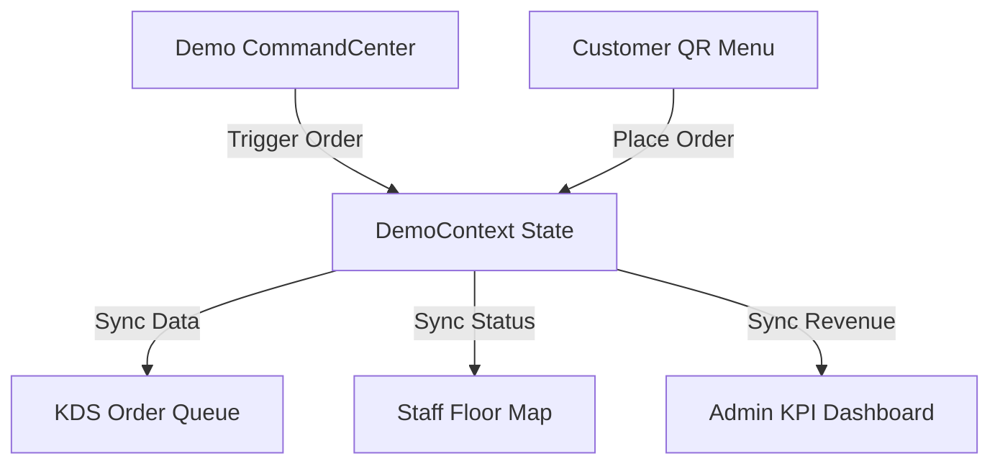

# Technical Architecture Blueprint

This document defines the code structure, data flow, component layout, and routing principles of the **HotelOS Digital Ecosystem**. It serves as the primary technical onboarding guide for developers and AI agents.

---

## 1. Project Overview
HotelOS is a premium, static, B2B sales-demo system showcasing a complete digital suite for hotels and restaurants. The codebase operates entirely client-side, using persistent context state and live timers to simulate real-time activities.

---

## 2. Folder Structure & Layout
```
hotel-saas/
├── public/                 # Static assets (Favicons, manifest.json)
├── scripts/                # Utility scripts (PDF generators, screenshot captures)
├── .agents/                # AI Agent Customizations Root
│   ├── rules/              # Permanent rules and handbook
│   └── context/            # System architecture and session context
├── src/
│   ├── components/         # Reusable components
│   │   ├── ui/             # Core UI components (Section, Skeletons)
│   │   ├── layout/         # Shell components (Navbar, Footer, Layouts)
│   │   └── demo/           # Demo tools (Command Center, Floating Bar)
│   ├── context/            # State contexts (Cart, Theme, Live Demo)
│   ├── data/               # Centralized data files (Menu, configuration, charts)
│   ├── pages/              # Primary route pages
│   │   ├── Admin/          # Admin dashboard & management suite pages
│   │   ├── QR/             # Customer ordering welcome, menu, cart views
│   │   ├── BookTable.jsx   # Booking page
│   │   ├── Home.jsx        # Sales-focused Landing portal
│   │   ├── Kitchen.jsx     # Dark-themed Kitchen Display board (KDS)
│   │   └── Staff.jsx       # Staff/Waiter table map & checkout POS
│   ├── App.jsx             # Main Router definition
│   ├── main.jsx            # React Entry Point & Toast providers
│   └── index.css           # Styling directives and custom Tailwind layers
├── postcss.config.js       # PostCSS config (Tailwind PostCSS plugins)
├── tailwind.config.js      # Custom theme layout tokens
└── package.json            # Vite metadata and scripts
```

---

## 3. Naming Conventions
- **Components**: PascalCase (e.g., `BillingModal.jsx`, `AnimatedSection.jsx`).
- **Pages**: PascalCase (e.g., `Kitchen.jsx`, `BookTable.jsx`).
- **Data/Mock Files**: camelCase (e.g., `chartData.js`, `menu.js`).
- **Contexts**: PascalCase + Context suffix (e.g., `CartContext.jsx`, `DemoContext.jsx`).

---

## 4. Component Architecture
Components are split into three layers:
1. **Core UI Controls (`src/components/ui/`)**: Pure, presentation-only components (e.g., counters, sections). They do not call contexts or handle navigation.
2. **Layout Components (`src/components/layout/`)**: Shell components providing context wrappers, footer/navbar details, and sidebars.
3. **Domain Pages (`src/pages/`)**: Route endpoints assembling UI elements and contexts to handle feature logic.

---

## 5. Routing Architecture
All routing is managed inside [App.jsx](file:///c:/Users/anike/Desktop/Work/Hotel_Saas/src/App.jsx) using:
- **`HashRouter`**: Required for compatibility with static hosting (GitHub Pages) to prevent 404 routing errors on page refresh.
- **`React.lazy` / `Suspense`**: Implemented for all major routes (`Admin`, `Kitchen`, `Staff`, `QR`) to enforce code-splitting and optimize initial page load speed.

---

## 6. State Management & Data Flow
State flows through a clean context hierarchy:
- **`ThemeContext`**: Handles dark mode and coordinates styling classes on the document head.
- **`CartContext`**: Manages customer order selections, customizations, coupon codes, and local storage persistence.
- **`DemoContext`**: The central "simulated server". Manages mock orders, table occupancy statuses, live notifications, and real-time revenue accumulations. Updates propagate to the KDS, Staff, and Admin dashboard pages instantly.



---

## 7. Styling & Design System
Styles are managed via **Tailwind CSS v4** coupled with custom styles in [index.css](file:///c:/Users/anike/Desktop/Work/Hotel_Saas/src/index.css).
- **Core Colors**:
  - `Gold (#C9A84C)`: Highlights premium accents, buttons, and best-seller ratings.
  - `Charcoal (#1A1A2E)`: Dark theme bases, navbar backgrounds, and header details.
  - `Cream (#F8F7F4)`: Light mode backgrounds.
- **Glassmorphism**: Glass and dark glass blur containers used for cards, floating controls, and overlay panels.

---

## 8. Business Logic Separation
UI components must never hardcode business data. All configs, menus, and charts are centrally defined:
- Hotel specifications live in [config.js](file:///c:/Users/anike/Desktop/Work/Hotel_Saas/src/data/config.js).
- Menu items and tags live in [menu.js](file:///c:/Users/anike/Desktop/Work/Hotel_Saas/src/data/menu.js).
- Chart data sets live in [chartData.js](file:///c:/Users/anike/Desktop/Work/Hotel_Saas/src/data/chartData.js).

---

## 9. Future Scalability Plan
- **Multi-Hotel SaaS Expansion**: Centralize `HOTEL_CONFIG` loading to fetch data based on subdomains or URL tokens.
- **Real Database Integration**: Centralize mock state mutations in Contexts so developers can swap context operations for real API queries without touching individual UI components.
- **PWA Capabilities**: Maintain a service worker template inside `public/manifest.json` to enable local offline ordering.
